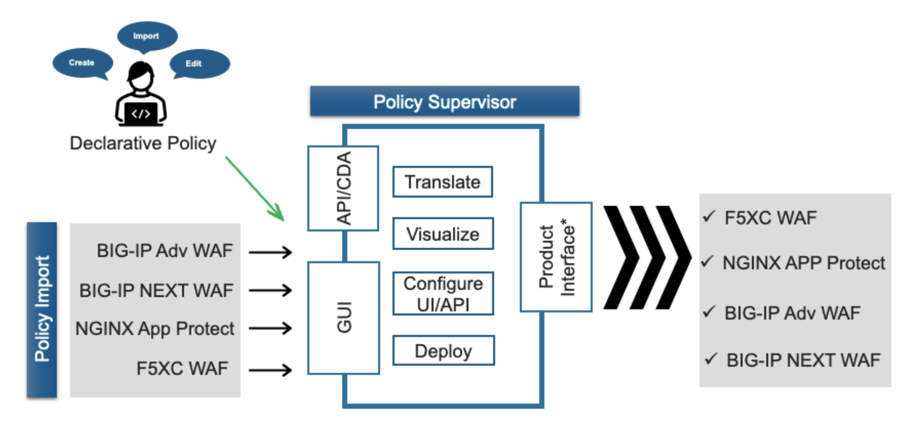
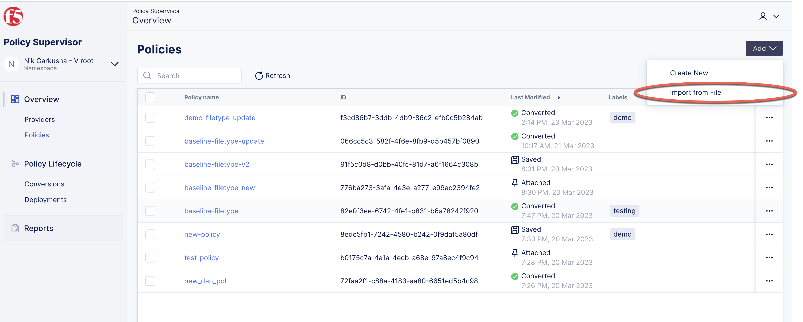
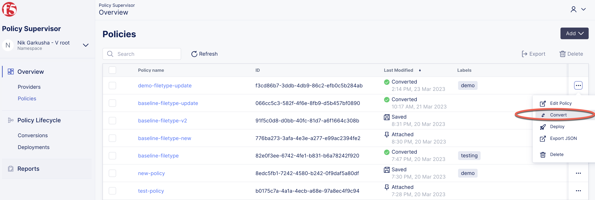

============================================
Tutorial: Convert with Policy Supervisor
============================================

.. contents:: Table of Contents

Summary
################################
Use this tutorial and the provided sample policies with the `Policy Supervisor <https://policysupervisor.io/>`_ (PS) project to convert WAF policies between different WAF platforms. There are two distinct workflows for doing the conversions:

- **Standard Policy Supervisor Workflow**: authenticate with `Policy Supervisor <https://policysupervisor.io/>`_ using Azure Active Directory, and then create a new "Policy" object from either a File Import or by setting up and connecting to a WAF "Provider". This saved policy can then be converted, deployed, and attached to one or more WAF providers to protect endpoints / applications.

- **Direct Conversion Utility**: use the `Conversion Utility <https://policysupervisor.io/convert>`_ to quickly perform a direct conversion of a policy from a source WAF format to a target WAF format. Because this approach does not require authentication, your converted Policies are not saved and must be downloaded & deployed/applied manually. 

``For more information and detailed "Getting Started Guide" please refer to the`` `Policy Supervisor User Guide <./guide/README.MD>`_

Supported WAF Solutions
#####################################

The following use-cases involving F5 WAF solutions are currently supported by Policy Supervisor:

**Policy Import From File**:

Using Policy Supervisor standard workflow or the direct conversion utility you can quickly import and convert a WAF policy file *from* the following F5 WAF solutions:

- *BIG-IP Advanced WAF*: Declarative JSON or XML format that has been exported from the following versions: v13.X, v14, v15, v16, v17 
- *NGINX App Protect WAF*: Declarative Policy in the JSON format from the following releases of NGINX App Protect: R27, R28, and R29 

**Policy Ingest From Provider**:

The standard workload within Policy Supervisor supports connecting to and ingesting the following policies:

- *BIG-IP Advanced WAF versions v13.X, v14, v15, v16, v17*: WAF, Bot, DoS
- *NGINX App Protect WAF releases R27, R28, and R29*: WAF

**Policy Deploy (and Attach) to Provider** (automatic):

The standard workload within Policy Supervisor supports connecting to and deploying Policies as well as attaching them to applications for immediate protection for the following solutions (and features):

- `*F5 Distributed Cloud Services* <https://f5.com/waap>`_ (XC): WAF, Bot, DoS

- *BIG-IP Advanced WAF versions v13.X, v14, v15, v16, v17*: WAF, Bot, DoS
- *NGINX App Protect WAF releases R27, R28, and R29*: WAF

**Policy Export to File(s)**:

Using Policy Supervisor standard workflow or the direct conversion utility you can quickly convert & export a WAF policy file *to* the following F5 WAF solutions:

- `*F5 Distributed Cloud Services* <https://f5.com/waap>`_: WAF
- *BIG-IP Advanced WAF (AWAF) versions v13.X, v14, v15, v16, v17*: WAF
- *NGINX App Protect (NAP) releases R27, R28, and R29*: WAF

Workstreams
################################

Policy Supervisor project simplifies the conversion and management of policies across multiple WAF solutions. It provides a web-based framework for connecting to and ingesting policies from user-configured Providers, as well as deployment and attachment of Policies to Providers. A standalone direct conversion utility is also provided to simplify conversions between different file formats. 

**Standard Policy Supervisor Workflow**
-------------------------------------------

1. Authenticate and log in at `Policy Supervisor <https://policysupervisor.io/>`_
2. Export a WAF policy from one of the supported providers; alternatively use a sample policy, such as one from `AWAF </big-ip-awaf>`_ or `NAP </nginx-app-protect-waf>`_ 
3. Import this policy into PS by going into *Policies* -> *Add* -> *Import from File*

4. From the Context menu for any of the imported policies, select "Convert" and follow the prompts to create a set of Conversions. Use Reports to see the details of the conversion.

5. Download the converted policy JSON file(s) and import into your WAF solution. NOTE: for F5 Distributed Cloud you can copy + paste the JSON configuration into the corresponding area within the XC Console. 

``TIP: Create Providers (BIG-IP, NGINX, or F5 Distributed Cloud) to automate the ingestion of WAF policies, and deployment / attachment of policies to the apps serviced by the Provider.``

**Conversion Utility Workflow**
--------------------------------
1. Export a WAF policy from one of the supported providers; alternatively use a sample policy, such as one from `AWAF </big-ip-awaf>`_ or `NAP </nginx-app-protect-waf>`_ 
2. Go directly into the `Conversion Utility <https://policysupervisor.io/convert>`_ and select the source Provider Type (AWAF or NGINX App Protect), and upload your exported policy file
3. Select the target (destination) provider type forman to convert the policy into. 
4. Download the converted policy JSON(s) and import into your WAF solution. NOTE: for F5 Distributed Cloud you can copy + paste the JSON configuration into the corresponding area within the XC Console. 

*Rinse and Repeat!*

For Any issue or problems with the conversion or either one of the Workstreams, go ahead and `raise an issue <https://github.com/f5devcentral/ps-convert/issues/new>`_ or contact the following email alias: *policysupervisor[AT]f5.com*. Please allow a couple of days for a reply and follow up on your issue. 
    
