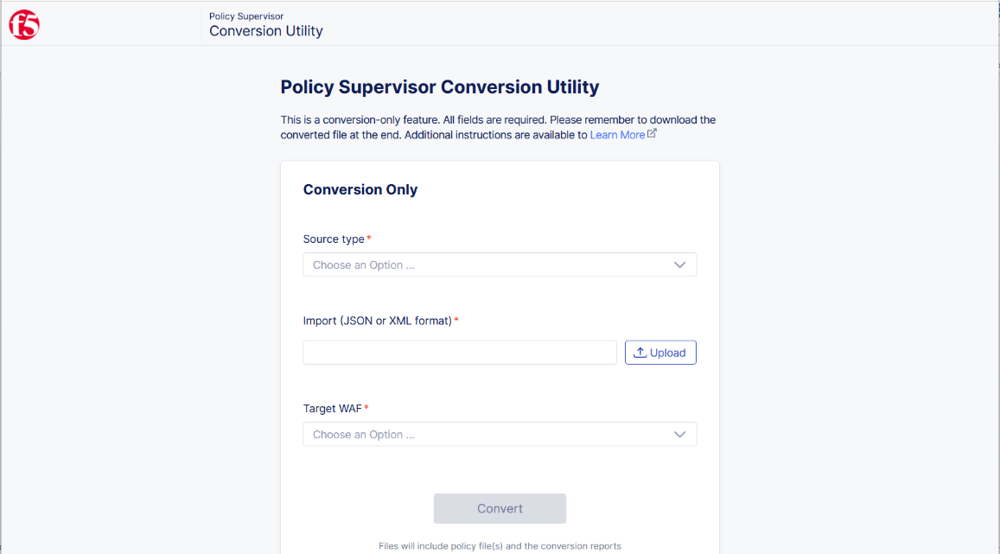
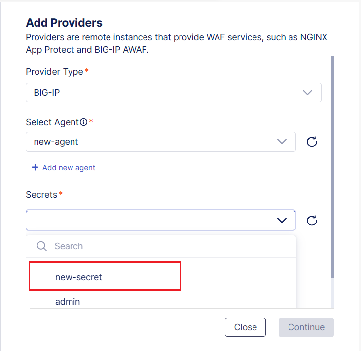
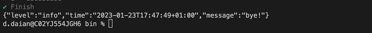
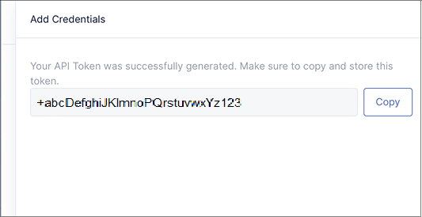
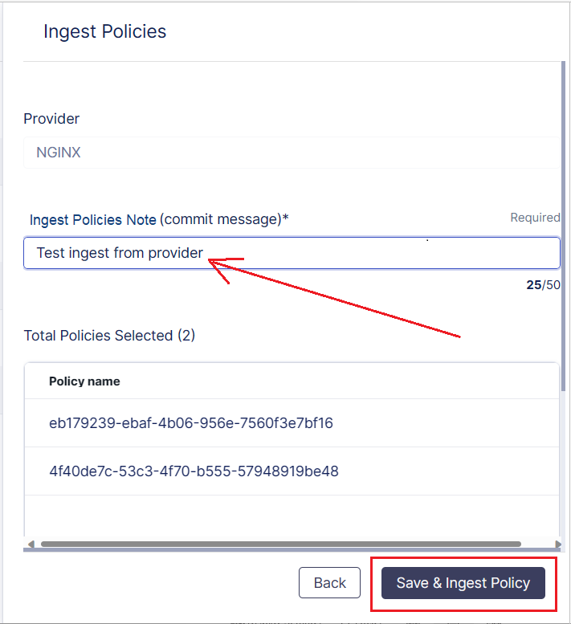
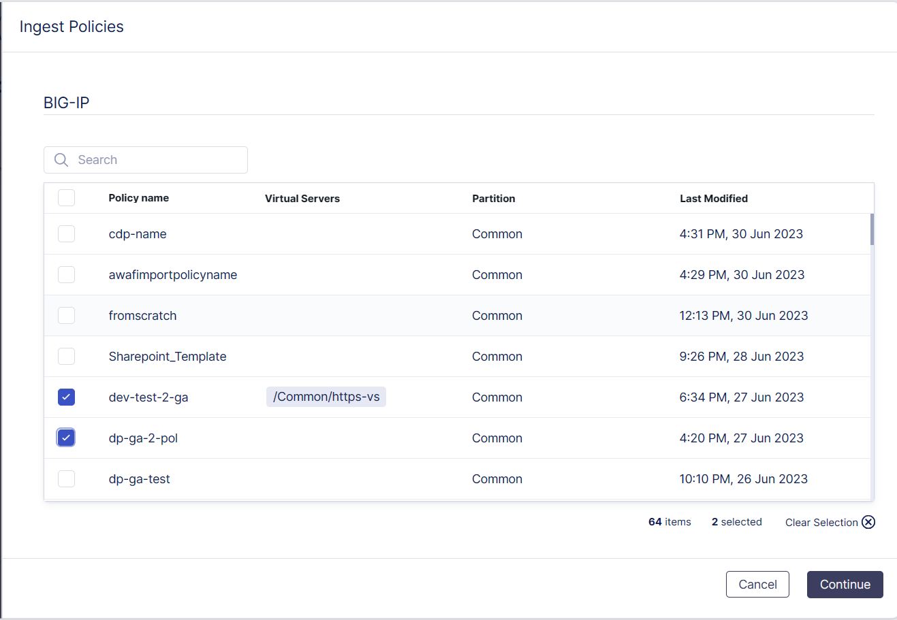
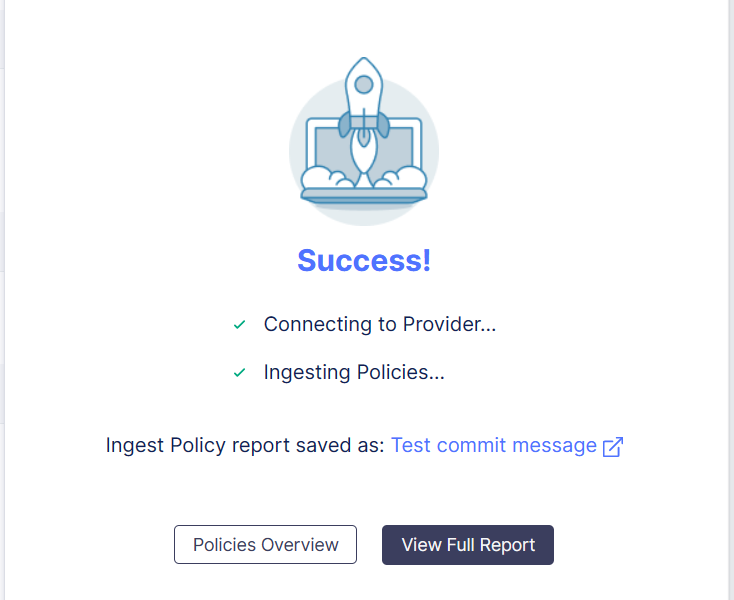
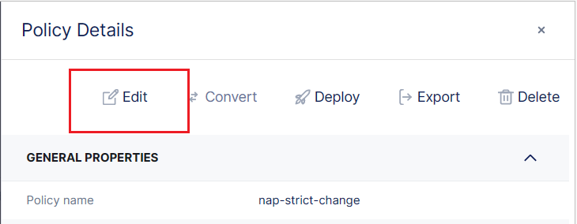

# Policy Supervisor Guide
*v0.17 June 2023*

# Table of Contents
- [Policy Supervisor Guide](#policy-supervisor-guide)
- [Policy Supervisor Overview](#policy-supervisor-overview)
- [Getting Started](#getting-started)
  * [Workspaces](#workspaces)
  * [Direct Conversion using the Conversion Utility](#direct-conversion-using-the-conversion-utility)
- [Providers](#providers)
  * [Adding a BIG-IP Provider](#adding-a-big-ip-provider)
  * [Adding an NGINX Provider](#adding-an-nginx-provider)
  * [Adding a Distributed Cloud Provider](#adding-a-distributed-cloud-provider)
  * [Adding and Configuring an Agent: BIG-IP and NGINX](#adding-and-configuring-an-agent--big-ip-and-nginx)
    + [Download the agent-installer package](#download-the-agent-installer-package)
    + [Run the installer and configure the agent](#run-the-installer-and-configure-the-agent)
    + [Complete the setup and agent options](#complete-the-setup-and-agent-options)
  * [Generating a Distributed Cloud API Token credential](#generating-a-distributed-cloud-api-token-credential)
  * [Deleting a provider](#deleting-a-provider)
- [Policies](#policies)
  * [Importing a Policy from File (BIG-IP, NGINX)](#importing-a-policy-from-file--big-ip--nginx-)
  * [Ingesting a Policy from a Provider (BIG-IP, NGINX)](#ingesting-a-policy-from-a-provider--big-ip--nginx-)
  * [Ingesting Policies with DDOS protection and Bot Defense profiles](#ingesting-policies-with-ddos-protection-and-bot-defense-profiles)
  * [Creating a New Policy from Template](#creating-a-new-policy-from-template)
  * [Working in the Policy Editor](#working-in-the-policy-editor)
    + [Syntax validation](#syntax-validation)
    + [References/Policy IDs](#references-policy-ids)
  * [Deleting a Policy](#deleting-a-policy)
- [Policy Conversion and Deployment](#policy-conversion-and-deployment)
  * [Deploying a policy: Conversion process](#deploying-a-policy--conversion-process)
  * [Deploying a policy: Deployment of successful conversion](#deploying-a-policy--deployment-of-successful-conversion)
- [Policy Lifecycle](#policy-lifecycle)
  * [Conversions](#conversions)
  * [Deployments](#deployments)
- [Reports](#reports)
  * [Report Details](#report-details)
    + [Conversion Reports](#conversion-reports)
    + [Deployment Reports](#deployment-reports)

# Policy Supervisor Overview

Policy Supervisor is an online unified configuration solution for
security policies, built with the purposes of managing and converting
configuration across multiple F5 Web App Firewall solutions.

It enables operators of F5 WAF technologies to easily convert policy
files from BIG-IP AWAF, F5 Distributed Cloud WAF, and NGINX NAP formats.
In the process Policy Supervisor generates and uses an intermediate
JSON-based common declarative format called CDP (Common Declarative
Policy) for policy lifecycle management. After a policy is converted to
CDP, it can then be deployed to any supported WAF Solution, which is
referred to as a Provider in Policy Supervisor lingo. Please refer to
the [GitHub repo for the Policy Supervisor
Tutorial](https://github.com/f5devcentral/ps-convert) for currently
supported Provider types.

Policy Supervisor provides a graphical interface for visual policy
creation, editing and management for traditional SecOps personas.

# Getting Started

Go to the Policy Supervisor host site <https://policysupervisor.io> and
log in using your organization Azure Active Directory (AAD) account, or
your personal Microsoft account.

When you log in, your account is automatically created so you don't need
to request account creation from an administrator or super user.

## Workspaces

Your default workspace is your Azure/Microsoft account name followed by
*root*. Only you can view this personal workspace and make updates. Any
other workspaces are accessible by invitation only; therefore, you will
only see your own workspace, and those that you were invited to.

## Direct Conversion using the Conversion Utility

If you have existing WAF configuration files that you would like to
convert quickly to one of the other WAF formats, you can do so before
logging on to Policy Supervisor by using the *Conversion Utility*. This
enables you to convert policies directly from one format to another,
without first converting to OneWAF/CDP.

The Conversion Utility provides the ability to convert a configuration
policy quickly, before you set up providers, test connections, and all
of the other tasks in Policy Supervisor that are covered in the sections
throughout the guide.

To convert a file by using the Conversion Utility, complete the
following steps:

1.  On the Policy Supervisor login screen, click the **Conversion
    Utility** label.  
    

2.  The *Conversion Utility* screen is displayed, with the options for
    uploading and converting your WAF configuration files.  
    

3.  In the **Source type** drop-down menu, choose the source file
    type.  
      
    

4.  Next, in the **Import (JSON or XML format**) field, click the
    **Upload** button, navigate to the source file location, and select
    the source WAF file that you want to convert.

5.  Then, in the **Target WAF** field, choose the target format from the
    drop-down menu. The two available target formats will be displayed
    depending on which source format you selected.

6.  With all fields and options selected, begin the conversion by
    clicking the **Convert** button.  
    

7.  Depending on the complexity of the file, the conversion might take a
    few minutes to complete.  
    

8.  When the conversion is completed, a success message is displayed.
    Save the converted file and the associated reports and log files by
    clicking the **Download** button.  
    

# Providers

A Provider is a generic name used by Policy Supervisor to indicate an F5
Web App Firewall. The supported Provider types are: F5 Distributed Cloud
WAF, BIG-IP Advanced WAF (AWAF), and NGINX Application Protection (NAP).
Add and connect providers in Policy Supervisor to enable the deployment
of your configuration policies across endpoints and load balancers for
complete WAF protection.

## Adding a BIG-IP Provider

When you add a BIG-IP instance as a provider, you must first set up an
agent and associated secret on the private network to enable a secure
connection between the BIG-IP instance and Policy Supervisor. For more
information, see the following section: [Adding and Configuring an
Agent: BIG-IP and
NGINX](#adding-and-configuring-an-agent-big-ip-and-nginx).

When you have installed your agent on the Linux machine/VM located on
the same network as the BIG-IP instance, you can complete the setup in
Policy Supervisor as follows:

1.  On the *Overview* \> *Providers* page, click **Add Provider**. If
    this is the first provider being added, there are two Add Provider
    buttons on the screen.  
      
    

2.  On the resultant *Add Providers* pane, in the *Provider Type*
    drop-down, choose **BIG-IP**.

3.  In the *Select Agent* field, choose the agent that will be used to
    connect to the BIG-IP provider. Either select an existing agent or
    create a new one as described in [Adding and Configuring an Agent:
    BIG-IP and
    NGINX](#adding-and-configuring-an-agent-big-ip-and-nginx).

4.  The *Secrets* field is then displayed. From the *Secrets* drop-down
    list, choose the secret to use and click **Continue**.  
      
      
      
    **Note**: An agent can have more than one secret associated with it,
    and all secrets are displayed in the *Secrets* drop-down list.

5.  In the *Provider Name* field, enter a name for this provider, and
    then in the *Provider URL* field, enter the URL where the BIG-IP
    provider instance is located.  
      
      
      
    **Note**: Ensure that you enter the full URL description, including
    *https://*

6.  In the *Labels* field, optionally add some label tags if you would
    like to have user-generated text that can be used to search for and
    organize your providers.

7.  Click **Test Connection** and wait for the connection processes to
    complete between Policy Supervisor and the provider.

8.  When the connection has completed, a *Success* message is displayed
    showing the connection details. From here you can add another
    provider or return to the *Providers Overview* page.

##  Adding an NGINX Provider

When you add an NGINX instance as a provider, you must first set up an
agent and associated secret on the private network to enable Policy
Supervisor to securely connect to the NGINX instance. For more
information, see the following section: [Adding and Configuring an
Agent: BIG-IP and
NGINX](#adding-and-configuring-an-agent-big-ip-and-nginx).

When you have installed your agent on the Linux machine/VM located on
the same network as the NGINX instance, you can complete the setup in
Policy Supervisor as follows:

1.  On the *Providers* page, click **Add Provider**. If this is the
    first provider across all provider types being added, there are two
    Add Provider buttons on the screen.

2.  On the resultant *Add Providers* pane, in the *Provider Type*
    drop-down, choose NGINX.  
      
    

3.  In the *Select Agent* field, choose the agent that will be used to
    securely connect to the NGINX provider. Either select an existing
    agent or create a new one as described in [Adding and Configuring an
    Agent: BIG-IP and
    NGINX](#adding-and-configuring-an-agent-big-ip-and-nginx).

4.  The *Secrets* field is then displayed. From the *Secrets* drop-down
    list, choose the secret to use and click **Continue**.  
      
    

5.  The remaining fields are then displayed. In the *Provider Name*
    field, enter a name for this provider.

6.  In the *SSH Server and Port* field, enter the IP address of the
    Nginx instance, and the ssh port number in the following format:
    \<ssh_server_ip\>:\<ssh_port\>  
      
      
      
    **Note**: The *SSH Server and Port* field contains placeholder text
    with an example of the required data format.

7.  In the *Labels* field, optionally add some label tags if you would
    like to have user-generated text that can be used to search for and
    organize your providers.

8.  Click **Test Connection** and wait for the connection processes to
    complete between Policy Supervisor and the provider.

9.  When the connection has completed, a *Success* message is displayed
    showing the connection details. From here you can add another
    provider or return to the *Providers Overview* page.

## Adding a Distributed Cloud Provider

When you add a provider of type Distributed Cloud, you are setting up a
connection to a Distributed Cloud namespace, to which you can then
deploy policy files and configurations. Distributed Cloud namespaces are
on a more open internet platform; therefore, you connect to Policy
Supervisor via a global agent and secret to begin communication.

Unlike the other two provider types, you don’t need to install an agent
behind a private network for a Distributed Cloud instance. The agent for
Distributed Cloud is stored on the Policy Supervisor system, and you set
up an API credential and secret for connecting to the platform. For
information on generating the API Token credential, see the following
section: [Generating a Distributed Cloud API Token
credential](#generating-a-distributed-cloud-api-token-credential).

To add a Distributed Cloud provider, complete the following steps.

1.  On the *Providers* page, click **Add Provider**. If this is the
    first provider across all provider types being added, there are two
    Add Provider buttons on the screen.

2.  On the *Add Providers* pane, click the *Provider Type* drop-down and
    choose **Distributed Cloud** from the list.  
    

3.  Select a secret from the Secrets drop-down list or add a new secret.
    To add a new secret, click **+ Add secret,** which opens the *Add
    Secret* pane.

4.  Enter a name for this secret in the *Secret Name* field.  
    

5.  In the *API Token* field, enter the generated token from your
    account in the Distributed Cloud console, as described in
    [Generating a Distributed Cloud API Token
    credential](#generating-a-distributed-cloud-api-token-credential).

6.  Once you have entered the API Token, click **Create**.

7.  When you return to the *Add Providers* pane, choose your new secret
    from the *Secrets* drop-down list, and click **Continue**.  
    **Note**: Click the *Refresh* button to update the Secrets list with
    the new secret.

8.  Add a name for this provider instance, and enter the URL for your F5
    Distributed Cloud tenant, typically in the following format:  
    *https://your_tenant.console.ves.volterra.io/*

9.  In the *Labels* field, optionally add some label tags if you would
    like to have user-generated text that can be used to search for and
    organize your Providers.

10. Click **Test Connection** and wait for the connection processes to
    complete between Policy Supervisor and the provider.

11. When the connection has completed, a *Success* message is displayed
    showing the connection details. From here you can add another
    provider or return to the *Providers Overview* page.

## Adding and Configuring an Agent: BIG-IP and NGINX

Before you can add a BIG-IP or NGINX provider instance in Policy
Supervisor, you must set up an “Agent” on the private network where the
provider is running to ensure a secure connection between Policy
Supervisor and the provider. 

- Ensure you have a machine or VM with Linux OS with an outbound
  connection located on the same network as the BIG-IP or NGINX instance
  that you’d like to use as a Provider in Policy Supervisor.

- The Policy Supervisor “Agent” is a Linux binary that is first
  installed on this machine/VM and is registered using a unique token
  generated in the Policy Supervisor UI <u>for your Policy Supervisor
  workspace only</u>.

- The Agent is used to create “Secrets”, which are stored <u>in your
  environment only</u> and are not transmitted outside of your network.

- These secrets are used to connect to your BIG-IP AWAF or NGINX NAP
  instance to execute various policy-related functions within a Docker
  container environment on that machine/VM.

- Ensure that Docker and wget are installed on your Linux machine/VM.

Adding and configuring an agent consists of the following sections:

- [Download the agent-installer
  package](#download-the-agent-installer-package)

- [Run the installer and configure the
  agent](#run-the-installer-and-configure-the-agent)

- [Set up the agent options](#complete-the-setup-and-agent-options)

### Download the agent-installer package

To download the installer package, complete the following steps:

1.  On the **Add Providers** pane on Policy Supervisor, having selected
    the provider type of *BIG-IP* or *NGINX*, in the *Select Agent*
    section click **+ Add new agent**.  
      
    

2.  An *Add Agent* pane slides out, with a token generated as a long
    text string. Copy and paste the Token to a text file to be used
    later.  
      
    

3.  In the *Add Agent* pane, click the **agent-install** link to open
    the GitLab repository.

4.  On the *gitlab.policysupervisor.io* site, right-click on the
    **agent-installer** file name and select **Copy Link**.  
      
      
      
    The following URL is copied to your clipboard:  
    *https://gitlab.policysupervisor.io/wafps/agent-install/-/package_files/322/download*

5.  Go to your Linux machine (navigate to it on an AWS virtual machine,
    or through puTTy for example), which is on the same network as your
    BIG-IP or NGINX instance.

6.  Download the installer via the command line by using the wget
    command and the GitLab URL:  
    wget
    https://gitlab.policysupervisor.io/wafps/agent-install/-/package_files/322/download  
      
    

7.  Wait for the package to download.  
    

8.  When the package is downloaded, use the ls command to show the
    downloaded package, which is shown as download.  
      
      
    You will rename it from download in the next section.

### Run the installer and configure the agent

When the package has downloaded, use the following commands to run the
agent installation.

1.  Rename the downloaded package from download to agent-installer by
    using the following command:  
      
    mv download agent-installer  
      
    List the directory contents again, and verify that the package is
    now displayed as agent-installer

2.  Next, give the installer package execution rights to enable it to
    run:  
      
    chmod +x ./agent-installer

3.  Then, go ahead and run the agent installer by using the following
    command:  
      
    sudo ./agent-installer  
      
    Some messages are displayed while the agent installer is running.  
    

4.  You are then prompted to enter the agent token.  
    **Note:** This step is only required when running the installer for
    the first time.

    Copy the agent token from the *Add Agent* screen on Policy
    Supervisor, or the text file where you pasted it previously, and
    paste it here.  
    

5.  Create the secret that will store the credentials to connect to the
    provider. Enter a name for the secret, which must be a unique secret
    name that hasn't been used before.  
    

6.  Informational messages are displayed for the connection and
    authentication methods to different providers.  
      
      
    **Note**: For NGINX, you must generate a root ssh key using the method described in the [ Synchronizing NGINX Configuration in a Cluster guide](https://docs.nginx.com/nginx/admin-guide/high-availability/configuration-sharing/#configure-root-ssh-access-to-the-peers)
    Using this method, the public key placed on your remote Nginx App
    Protect instance. The private key is located on the Linux machine/VM
    where you are creating the agent. All ssh key and certificate
    details are normally stored in .pem format on the Linux machine. In
    the next step, you enter the path to this .pem file, so that it will
    be used when connecting Policy Supervisor to the NGINX instance.

7.  Enter the username and password that will be stored in the secret,
    and for NGINX, the path to the .pem file containing the ssh key
    details, for example, /home/\<your_name\>/.ssh/file.pem  
      
      
    **Note**: The username and password you enter here are the
    credentials that you use when you are logging in to the BIG-IP
    Configuration Utility.

8.  You can then assign the name for the agent, which is the name that
    will be displayed when selecting it in the *Add Provider* screen.  
      
    

9.  When you assign the agent name, the installation continues.  
      
    When the installation is completed, you are then provided with some
    additional setup options for the agent.

### Complete the setup and agent options

When you have downloaded and run the *agent-installer*, there are some
additional setup options to complete for the agent installation.

For adding BIG-IP providers, ensure connectivity between the agent host 
and the BIG-IP's management IP on TCP port 443 (HTTPS) or TCP port 8443 
for single-NIC BIG-IP VE.

For adding NGINX providers, ensure connectivity between the 
agent host and the NGINX instance on TCP port 22 (SSH)

1.  The following setup options are displayed:  
      
    Finish  
    Add Secret  
    Remove Secret  
    Update Secret  
    Reset  
    View  
      
    

2.  Use the arrow keys to navigate and select each option:  
      
    Finish – completes the agent installation and exits the process.  
      
    Add Secret – allows you to add another secret to the agent, whereby
    you would enter an additional secret name, with another username and
    password.  
      
    Remove Secret – displays the existing secrets for this agent, and
    enables you to select one and remove it.  
      
    Update Secret - displays the existing secrets for this agent, and
    enables you to select one and update it. For example, change the
    secret name, username, and/or password.  
      
    Reset – removes the agent completely.  
      
    View - this shows the name and workspace from Policy Supervisor for
    this agent, for example 'Firstname Surname - C Workspace test'.

3.  When you select Finish on the list of options, the agent
    installation is completed.  
    

4.  Your agent will now be available for selection in the *Select Agent*
    drop-down list when you add a provider in Policy Supervisor, and the
    associated secrets in the *Secrets* drop-down list.  
      
    

## Generating a Distributed Cloud API Token credential

Distributed Cloud providers are on an open internet connection;
therefore, they don’t need an agent installed and configured on a
private network. However, there is a requirement to set up a secret
before you can connect to a Distributed Cloud provider in Policy
Supervisor.

As part of the secret setup, you must first generate an API Token
credential in the Distributed Cloud console. To generate this token
credential, complete the following steps.

**Note**: At this time, the user account for which an API Token is generated must have ves-io-admin role on all application namespaces, including system.

1.  Log on to the *F5 Distributed Cloud UI*. 

2.  Go to your *User Account* menu and click **Account Settings**.  
    

3.  On the *My Account* page, go to the left-hand Administration menu \>
    *Personal Management*, and click **Credentials**.

4.  On the *Credentials* page, click the **Add Credentials** button.  
      
      
    The *Add Credentials* pane slides out with fields and details to be
    completed.

5.  Enter a *Name* for the credential and choose *API Token* as the
    authentication type to be generated, along with an *Expiry Date*.  
    - Credential Name  
    - Choose API Token  
    - Expiry date

6.  With *Name*, *Credential type*, and *Expiry Date* selected, click
    **Generate**.  
    

7.  The API token is generated, which you can copy to the clipboard for
    using in the *Add Provider* setup in Policy Supervisor.  
      
    

8.  Click **close** on the *API token* pane to return to the
    *Credentials* page.

## Deleting a provider

You can disconnect from an existing provider and remove it from Policy
Supervisor if required. To delete a provider, complete the following
steps:

1.  On the *Providers* page, click the *Action menu* **(…)** for the
    provider you want to delete.

2.  From the *Action menu*, choose **Delete**.

3.  The connection is stopped, and the provider is removed from the
    *Providers* page.

# Policies

The Policies page displays the existing policies that you are working
with in Policy Supervisor and enables you to import and add new policies
that you can edit and deploy.

To add policies to Policy Supervisor, you have the following options:

- **Import** a policy from file.

- **Ingest** directly from provider.

- **Create** a new policy.

## Importing a Policy from File (BIG-IP, NGINX)

If you have exported policy files from your provider interface such as
BIG-IP or NGINX into .JSON format, you can import them to Policy
Supervisor for conversion and deployment.

To import a policy from file, complete the following steps:

1.  In the top-right corner of the *Policies* page, click the **Add**
    button and choose *Import from File*.  
    

2.  On the *Import Policy* pane, in the *Policy Name* field, enter the
    name that you want to display for the policy.  
    

3.  In the *Policy Type* field, choose **BIG-IP** or **NGINX** from the
    drop-down list.  
    **Note**: Distributed Cloud policy type isn’t supported for file
    import in the current release.

4.  Upload the JSON export of the AWAF or NAP policy by clicking the
    **Upload** button and browsing to the file on your computer.

5.  Add some descriptive notes about the policy in the *Import
    Notes/Summary* field and click **Import**.  
    **Note**: The text that you enter in the Import Notes/Summary field
    is used as the name of the Report that is created for the conversion
    on the Reports page.

6.  The files are imported and the conversion to OneWAF/CDP format
    completes. A conversion summary report displays the policy settings
    (configurations) that have been successfully converted, partially
    converted, or not supported. For more information on these details,
    see [Reports](#reports).

7.  At the bottom of the *Conversion Completed* pane, click the **Edit
    Policy** button to view the imported policy in the Editor. Here you
    can review and make updates to the imported policy if necessary.

## Ingesting a Policy from a Provider (BIG-IP, NGINX)

You can ingest a policy directly from a connected BIG-IP or NGINX
provider for conversion and deployment to another provider type.

To ingest a policy from a provider, complete the following steps:

1.  On the *Providers* page, click on a provider name to display the
    *Provider Details* pane and click **Ingest Policies**.  
    

2.  On the *Ingest Policies* pane, select one or more policies from the
    list and click **Continue**.  
      
    

3.  In the *Ingest Policies Note* field, enter a commit message, and
    then click **Save & Ingest Policy**.  
      
      
    A status page is displayed while connecting to the provider and
    ingesting the policies.

4.  When the policies have been successfully ingested, a *Success* page
    is displayed with the following options:  
      
    - **Ingest Policy report saved as**: *Commit message*; click this
    commit message text to open the *Reports* page in a new window.  
    - **Policies Overview**; click to return to the *Policies* page.  
    - **View Full Report**; click to open the report details of the
    ingest and conversion. For more information on report details, see
    [Reports](#reports).

## Ingesting Policies with DDOS protection and Bot Defense profiles

Policy Supervisor enables you to ingest policies that are configured for
DDoS protection profiles, and Bot defense profiles. To ingest these
policies, complete the following steps:

1.  Go to a BIG-IP provider and click **Ingest Policies**.

2.  On the resultant policies pane, select the policies that contain the
    configuration profiles for DDoS and Bot Defense, and click
    **Continue**.  
      
    

3.  On the **Policy** pane, select the DoS Protection Profiles to use,
    and the Bot Defense profiles and click **Next**.  
    

4.  Do the same for the second policy, or leave it with no selections if
    necessary, then click **Next**.  
    

5.  On the *Ingest Policies* *summary* pane, review the details of the
    selected policies and the associated DoS and Bot profiles, and then
    click **Save & Ingest Policy**.  
    

6.  The Ingest Policies progress pane provides the status as the
    policies are being ingested.

7.  When the policies have been ingested successfully, a success message
    is displayed.  
      
    From here you can return to the **Policies Overview**, or click
    **View Full Report** to view the report details for the ingestion
    process.  
      
    **Note**: For NGINX Ingest policies, there are only DDoS protection
    profiles available, ie. no Bot defense profiles.  
    

## Creating a New Policy from Template

You can create a policy directly in the Policy editor, using the OneWaf
file template to structure the content correctly.

To create a new policy, complete the following steps:

1.  In the top-right corner of the *Policies* page, click the **Add**
    button and choose **Create New**.

2.  On the *Create a new policy* pane, enter a name for the new
    policy.  
    **Note**: The policy name can’t contain any spaces.

3.  Click the *Template* field and select the template from the
    drop-down list.  
    

4.  Add optional tags in the *Labels* field, then click **Continue**.

5.  The policy editor is displayed in the CDP template format, enabling
    you to update any configuration details, or copy and paste a valid
    JSON policy in CDP format.

6.  To save the new policy, click **Save**. The policy is then displayed
    on the *Policies* page.

## Working in the Policy Editor

When you import a policy or create a new one, you can make changes to
the configurations and settings of the policy in the Policy Editor.

On the *Policies* page, click on a **Policy name** to open the *Policy
Details* pane. In the Policy Details pane, click **Edit**.

The policy will open in the Policy Editor, enabling you to check the
content and make updates if necessary.

### Syntax validation

The policy is displayed in Common Declarative Policy (CDP) format by
default in the Policy Editor. When you work on a new policy or make
changes to an existing one, your updates are checked automatically using
real-time syntax validation.

You can check for any information that might be available to further
clarify the syntax error with a keypress of ctrl and space. If there is
additional information available a message is displayed, otherwise it
shows “No suggestions”.

### References/Policy IDs

To enable the sharing of certain objects within policies such as Trust
Lists and Overlay Protocols, you can add references within a protocol
configuration, and this allows the object to be shared by multiple
policies.

Every policy must have a Policy ID name/value pair, and this provides
the ability to reference the ID from other policies.

Each reference object is given an auto-generated ID, and each policy in
a workspace needs a unique name. If a policy that was converted to
support references has a name conflict, a new name will be generated by
appending a unique string at the end of the policy name.

An overlay protocol has an ID associated with it, enabling the sharing
of this item in another policy. **Note**: When a reference is being
reused in another policy, these policies must be within the same
workspace.

## Deleting a Policy

If you no longer need a policy, or it has become corrupt/invalid, you
can delete it from Policy Supervisor if required. To delete a policy,
complete the following steps:

1.  On the *Policies* page, click the **Action menu (…)** for the policy
    you want to delete.

2.  From the menu, choose **Delete**.  
    A confirmation dialog box is displayed asking you to confirm that
    you want to proceed.

3.  Click **Delete** on the confirmation dialog. The policy is deleted
    and is removed from the *Policies* page.

# Policy Conversion and Deployment

Valid policies can be deployed from the *Policies* page and attached to
BIG-IP, NGINX, and Distributed Cloud providers. When you run the
deployment function, the policy is first converted to the target
provider type format. If successfully converted, the policy is then
deployed and attached to the provider. A report is generated after each
conversion.

## Deploying a policy: Conversion process

To run the deployment process beginning with the conversion, complete
the following steps:

1.  On the *Policies* page, select the *Policy name*, and on the *Policy
    Details* pane, click the **Deploy** button.  
      
      
    Alternatively, click the **action menu (…)** for the policy and
    choose **Deploy**.

2.  From the resultant *Deployment* page, click the *Provider* drop-down
    menu.

3.  Each virtual server and namespace are shown for the BIG-IP,
    Distributed Cloud, and NGINX providers respectively. You can select
    the endpoints that you want to deploy the policy to or *Select
    All*.  
    

4.  When you have selected the provider endpoints, click outside the
    drop-down to close the list. The selected endpoints are displayed as
    items in the *Provider* field.

5.  In the *Deployment Note/Summary* field, enter a commit message for
    the deployment.  
    **Note**: The text that you enter in the Import Notes/Summary field
    is used as the name of the report that is created for the deployment
    on the Reports page.

6.  Click **Conversion Summary** to start the conversion process. If you
    have selected two provider types, it will do the conversion for
    both. For example, from CDP to AWAF format, and from CDP to
    Distributed Cloud WAF.

7.  On the *Conversion Summary* page, it shows the results for the
    conversion to the selected provider type. A report is displayed for
    the conversions, showing the numbers of configuration items that
    were converted with *Full Support*, *Partial support*, and *No
    Support*.  
      
    

8.  Click **Save & Continue** to proceed with the Deployment.

## Deploying a policy: Deployment of successful conversion

Upon successful conversion of a policy, continue with the Deployment as
follows:

1.  On the *Conversion Success* screen, click **Continue Deployment**.  
      
    

2.  The Endpoint Attachment screen will be displayed for the provider
    type you are deploying to: *Distributed Cloud*, *BIG-IP*, *NGINX*.

3.  For *Endpoint Attachment: Distributed Cloud*, click the **Load
    Balancers** drop-down for the provider, select the load balancer to
    deploy to and click **Next**.  
      
    

4.  For *Endpoint Attachment: BIG-IP*, select the partition and
    corresponding virtual servers to attach the policy to.

5.  On the Deployment Attachments for Selected Providers page, review
    the tenants and load balancers, and the partitions and virtual
    servers that you are deploying to, then click **Deploy**.  
    

6.  A successful deployment is displayed on the *Deployment Completed*
    page. From here you can click the following options:  
    - **Back to Overview**: Returns you to the *Policies* page.  
    - **View Report**: Takes you to the *Deployment report*.  
    - **Deployment saved as** \[policy name\]: Takes you to the
    *Deployments* page for that policy.

# Policy Lifecycle

The *Policy Lifecycle* page displays details of the conversions and
deployments that have taken place in Policy Supervisor.

## Conversions

The *Conversions* page provides a list of all conversions that have
taken place for each policy. This includes conversions on imported files
to OneWaf/CDP, and subsequent conversions for different provider types.

Each conversion is listed with its *Policy name*, *Date*, *Target
Provider Type*, and *Status* of the conversion.

From the **Actions (…) menu** for any conversion that is listed, you can
*view the logs* of the conversion, as well as *download the policy* that
was converted.

## Deployments

The Deployments page lists all the policy deployments along with the
following information for each deployment: *Policy name*, *Deployment
Date*, *Status*, *Provider*, and *number of attachments*.

To view the log files for any deployment, click the **Actions menu** \>
**View logs**. The log file is downloaded and saved with a file name
composed of the policy and provider names.

# Reports

On the Reports page, the report for each conversion and deployment that
has taken place is listed with details for each one.

The Report name is taken from the deployment or commit message text that
you provided when creating the conversion or deployment.

To see the details of a report, click the *Report name*, and the *Report
details pane* slides out.

## Report Details

The Report details pane contains a **General Properties** section, a
**Conversion** section, and a **Deployment** section if applicable. The
General Properties section displays information such as the *Report
Name*, *type* of report, and the *policies* converted/deployed.

### Conversion Reports

For conversion reports, the Conversion section displays the **Target
Provider Type**. This will be CDP/OneWAF in the case of a policy
ingestion/import from file.

To see the details of the conversion, expand the **Target Provider
Type** section.

The details of the policy items that have been converted are displayed
in the following three states:

- *Full Support*: the settings converted fully from the source provider
  format to OneWAF/CDP.

- *Partial Support*: some settings in the category have been converted
  fully, some others have not been converted. This may happen either: A)
  because OneWAF may not have a corresponding configuration or setting,
  or B) this feature is not yet supported by the Policy Supervisor
  converter.

- *No Support*: this group of features is not yet supported by the
  Policy Supervisor converter.

### Deployment Reports

For Deployment reports, the provider *type*, *attachments*, and items
that were deployed during the process are displayed. The **Deployment**
section shows the *Providers* that the policies were deployed to, along
with the number of attachments to namespaces/virtual servers.

Deployment reports also have a **Conversion** section with details of
the conversion to the target provider type.

For reports that have multiple policies, you can click each **Target
Provider Type** section to expand the details of that conversion.
